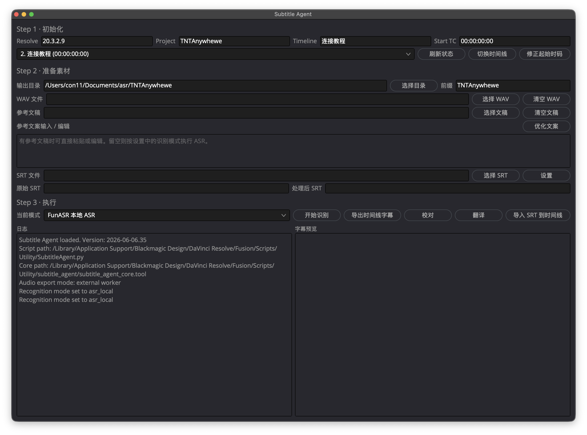

# Subtitle Agent for DaVinci Resolve



Subtitle Agent 是一个运行在 DaVinci Resolve `Workspace -> Scripts` 菜单里的 macOS Python 字幕工具。它把音频导出、云端 ASR 识别、SRT 校对、翻译、参考文案优化和导入时间线集中到一个 Resolve UI 界面中。

目前仅面向 macOS。Windows 暂未适配。

## 主要功能

- 从当前 DaVinci Resolve 时间线导出音频。
- 使用 DashScope 云端 ASR 生成 SRT。
- 使用 Resolve 内置字幕识别并导出 SRT。
- 使用 OpenAI 兼容接口接入 DashScope / DeepSeek 模型进行 SRT 校对。
- 将 SRT 翻译为指定目标语言，并按语言后缀保存文件。
- 预览、手动编辑 LLM 输出结果，再决定是否应用到主页 UI。
- 将最终 SRT 导入当前 DaVinci Resolve 时间线。

## 文件结构

```text
SubtitleAgent.py              # DaVinci Resolve 插件入口
subtitle_agent_standalone         # 独立 GUI + CLI（无需 Resolve）
subtitle_agent/
  subtitle_agent_core.tool    # 核心模块和外部 worker
  subtitle_agent_config.json  # 本地配置，不提交 git
  subagent.png                # UI 截图
README.md
.gitignore
```

`SubtitleAgent.py` 是 DaVinci Resolve 可识别的脚本入口。

`subtitle_agent/subtitle_agent_core.tool` 是核心模块和外部 worker。后缀使用 `.tool`，避免被 Resolve 当作脚本菜单项显示。

## 安装位置

把项目文件放到 DaVinci Resolve 的 Utility 脚本目录：

```text
/Library/Application Support/Blackmagic Design/DaVinci Resolve/Fusion/Scripts/Utility/
```

最终至少需要：

```text
/Library/Application Support/Blackmagic Design/DaVinci Resolve/Fusion/Scripts/Utility/SubtitleAgent.py
/Library/Application Support/Blackmagic Design/DaVinci Resolve/Fusion/Scripts/Utility/subtitle_agent/subtitle_agent_core.tool
```

重启 DaVinci Resolve 后，在：

```text
Workspace -> Scripts -> SubtitleAgent
```

打开脚本。

## 首次使用准备

### 1. 安装 Python

Resolve 内置 Python 只负责打开 UI 和调用 Resolve API。ASR、LLM、音频处理等重任务由外部 Python 环境执行。

请到 Python 官网下载 macOS installer：

[https://www.python.org/downloads/](https://www.python.org/downloads/)

不建议使用 Homebrew 安装的 Python 作为外部环境。Resolve / Fusion 脚本环境在 macOS 上可能无法正确识别 brew Python 的路径和动态库布局。

确认可用：

```bash
python3 --version
```

### 2. 安装 ffmpeg

脚本使用 ffmpeg 做音频转码。

```bash
brew install ffmpeg
```

确认可用：

```bash
ffmpeg -version
ffprobe -version
```

脚本会自动把 `/opt/homebrew/bin` 和 `/usr/local/bin` 加入 worker 环境，解决 DaVinci 从 GUI 启动时找不到 Homebrew 命令的问题。

### 3. 安装 Python 依赖

Worker 进程需要 `openai` 和 `dashscope` 两个依赖。直接安装在系统 Python 即可：

```bash
pip3 install openai dashscope
```

或创建虚拟环境：

```bash
mkdir -p ~/Documents/subtitle_agent
python3 -m venv ~/Documents/subtitle_agent/venv
source ~/Documents/subtitle_agent/venv/bin/activate
pip install openai dashscope
```

配置中的 `python_path` 需指向该虚拟环境的 Python：

```json
{
  "python_path": "~/Documents/subtitle_agent/venv/bin/python"
}
```

### 4. 配置 API Key

云端 ASR 和 LLM 功能需要 DashScope API Key。

首次运行后打开脚本里的 `设置`，填写 `DashScope Key`。

也可以直接编辑：

```text
subtitle_agent/subtitle_agent_config.json
```

注意：该配置文件可能包含 API Key 和本机路径，已被 `.gitignore` 忽略，不应提交到 git。

## 推荐首次流程

1. 打开 DaVinci Resolve 项目和时间线。
2. 运行 `Workspace -> Scripts -> SubtitleAgent`。
3. 点击 `刷新状态`，确认当前项目、时间线和起始时码。
4. 如果时间线起始时码不是 `00:00:00:00`，点击 `修正起始时码`。
5. 设置输出目录。默认输出到 `~/Documents/subtitle_agent/当前项目名称/`。
6. 选择当前模式：`远程 ASR` 或 `Resolve 内置字幕生成`。
7. 点击 `开始识别`。
8. 生成后可点击 `校对` 或 `翻译`，在右侧结果框中确认或手动修改，再点击 `应用结果`。
9. 点击 `导入 SRT 到时间线`。

## 独立 GUI（无需 DaVinci Resolve）

可以不打开 Resolve，直接运行独立 GUI：

```bash
python3 subtitle_agent_standalone
```

界面布局：

```
+-- 文件 -----------------------------------------------------+
|  WAV 音频: [浏览]                                              |
|  输出目录: [浏览]                                              |
+-- 参考文案 --------------------------------------------------+
|  文稿文件: [浏览] [加载] [优化文案]                             |
|  [编辑区 - 粘贴/编辑参考文案]                                  |
+-- 操作 -----------------------------------------------------+
|  [开始识别] [校对] [翻译] [设置]                              |
+-------------------------------+------------------------------+
|  日志                         |  字幕预览                    |
+-------------------------------+------------------------------+
```

设置通过 `File > Settings` 配置 API Key、模型、提示词等。

## CLI 命令行

同一脚本也支持命令行调用，适合脚本集成或自动化：

```bash
# ASR 识别
python3 subtitle_agent_standalone asr audio.wav subtitles.srt

# 校对 SRT
python3 subtitle_agent_standalone proofread input.srt output.srt

# 翻译 SRT
python3 subtitle_agent_standalone translate input.srt output.srt --target en

# 优化参考文案
python3 subtitle_agent_standalone optimize input.txt output.txt

# 简繁转换
python3 subtitle_agent_standalone convert input.srt output.srt --lang zh-tw

# 查看 SRT
python3 subtitle_agent_standalone read subtitles.srt
```

API Key 优先级：`--api-key` 参数 > 配置文件 > `DASHSCOPE_API_KEY` 环境变量。

## 输出文件命名

输出文件会带项目名前缀和处理方式后缀，例如：

```text
Project_audio_align.wav
Project_subtitles_asr_remote_raw.srt
Project_subtitles_resolve_builtin_raw.srt
Project_subtitles_zh_cn.srt
Project_reference_optimized.txt
```

翻译结果会带目标语言后缀，避免多语言结果互相覆盖。

## 常见问题

### DaVinci 菜单里看不到脚本

确认 `SubtitleAgent.py` 直接位于 Resolve 的 `Utility` 脚本目录下，而不是嵌套在子文件夹里。

### 找不到 ffmpeg

确认已经安装：

```bash
brew install ffmpeg
```

并确认：

```bash
which ffmpeg
```

应该输出 `/opt/homebrew/bin/ffmpeg` 或 `/usr/local/bin/ffmpeg`。

### Worker 报告找不到 Python 模块

确认设置页里的 `python_path` 指向安装了 `openai` 和 `dashscope` 的 Python 环境。

可以手动验证：

```bash
/path/to/your/python -c "import openai; import dashscope; print('OK')"
```

### LLM 功能不可用

确认外部 Python 环境安装了 `openai`，并且设置里填写了 DashScope API Key。

## 开发说明

```bash
python3 -m py_compile SubtitleAgent.py
python3 -m py_compile subtitle_agent/subtitle_agent_core.tool
```

不要把 `subtitle_agent/subtitle_agent_config.json`、音频、字幕输出文件提交到 git。
