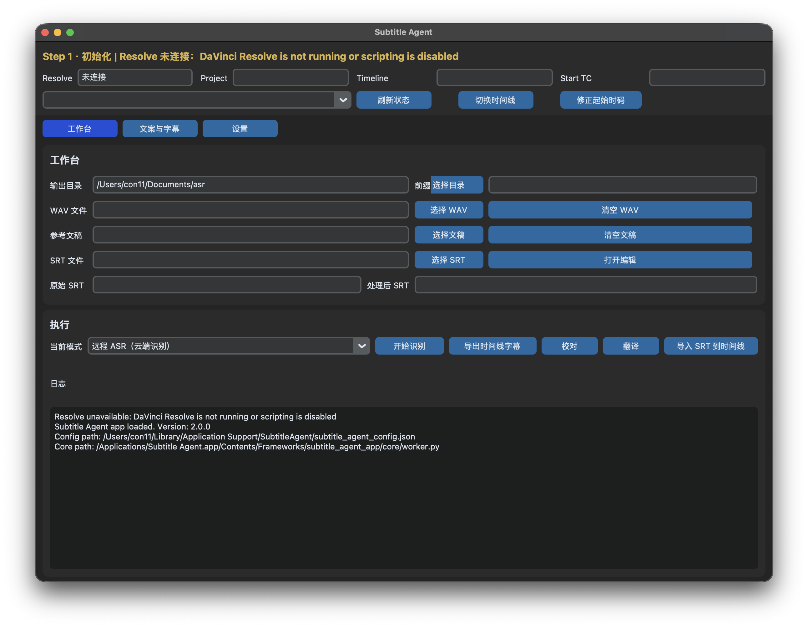

# Subtitle Agent for DaVinci Resolve



Subtitle Agent 现已调整为 **macOS 主应用优先** 的字幕工具：主界面使用 CustomTkinter，支持双击 `.app` 打开。

目前仅面向 macOS。Windows 暂未适配。

## 主要功能

- 连接当前 DaVinci Resolve 项目与时间线。
- 导出时间线音频、导出当前时间线字幕、导入最终 SRT 到时间线。
- 三种字幕识别模式：
  - 远程 ASR
  - 强制对齐
  - Resolve 原生识别
- 使用 OpenAI 兼容接口接入 DashScope / DeepSeek 做 SRT 校对、翻译、参考文案优化。
- 在结果窗口中手动编辑 LLM 输出，再决定是否应用到主页。
- 强制对齐基于 [corvo007/cpp-ctc-aligner](https://github.com/corvo007/cpp-ctc-aligner) 的 macOS release 产物接入，不在本仓库内重新编译。
- 推荐初始化模型为 [csukuangfj2/sherpa-onnx-omnilingual-asr-1600-languages-300M-ctc-int8-2025-11-12](https://huggingface.co/csukuangfj2/sherpa-onnx-omnilingual-asr-1600-languages-300M-ctc-int8-2025-11-12)。

## 快速开始

### 1. 一键启动 app

如果你已经有打包好的 app，直接双击启动即可：

如果首次打开被 macOS 拦截，请先双击压缩包内附带的 `fix_quarantine.command`，再重新打开 `Subtitle Agent.app`。

### 2. 打开初始化面板

启动 app 后，在首页点击 `初始化`。

初始化面板可以：

- 检查 `Homebrew`、`ffmpeg` 和强制对齐模型状态
- 通过 Homebrew 一键安装 `ffmpeg`
- 下载推荐 Omnilingual ONNX 对齐模型
- 保存基础 LLM 配置

推荐模型下载源：

- 镜像优先：`https://hf-mirror.com/csukuangfj2/sherpa-onnx-omnilingual-asr-1600-languages-300M-ctc-int8-2025-11-12`
- 官方回退：`https://huggingface.co/csukuangfj2/sherpa-onnx-omnilingual-asr-1600-languages-300M-ctc-int8-2025-11-12`

## 当前识别模式

主 app 当前提供三种识别模式：

- `远程 ASR（云端识别）`
- `强制对齐（参考文案 + 音频）`
- `Resolve 原生识别（当前时间线）`

其中强制对齐默认可通过初始化面板自动下载 Omnilingual ONNX 模型；如果手动配置本地模型目录，目录内需至少满足以下之一：

- `model.int8.onnx` + `tokens.txt`
- `model.onnx` + `vocab.json`


## 项目结构

```text
SubtitleAgent.py              # Resolve 菜单桥接启动器
subtitle_agent_app.py         # macOS app 兼容入口（GUI + CLI + bundled worker）
subtitle_agent_app/           # 主 app package
  main.py                     # 启动、CLI 分发、主 App 组装
  state.py                    # 运行状态初始化
  services.py                 # 文件读取与预览文本转换
  dialogs/result.py           # LLM 结果弹窗
  panels/workbench.py         # 工作台页面
  panels/editor.py            # 文案与 SRT 双栏编辑页
  panels/settings.py          # 设置页
  core/                       # 核心业务与 worker
    api.py                    # 对外统一接口
    worker.py                 # 外部 worker 入口
    resolve_ops.py            # Resolve 相关操作
    srt_ops.py                # SRT 解析/转换
    asr_ops.py                # 远程 ASR
    align_ops.py              # 强制对齐
    llm_ops.py                # LLM 校对/翻译/文案优化
subagent.png                  # UI 截图
subtitle_agent/
README.md
AGENT_ENV_SETUP.md
requirements.txt
SubtitleAgent.spec
build_macos_app.sh
run_ui_debug.sh
```

## 配置文件位置

app 与 worker 统一使用这个配置文件：

```text
~/Library/Application Support/SubtitleAgent/subtitle_agent_config.json
```

如果存在旧版配置：

```text
/Library/Application Support/Blackmagic Design/DaVinci Resolve/Fusion/Scripts/Utility/subtitle_agent/subtitle_agent_config.json
```

首次启动 app 时会自动迁移。
## 开发者
<details>
<summary><strong>折叠内容</strong></summary>

### 调试启动 UI

```bash
./run_ui_debug.sh
```

### 源码运行

```bash
python3 subtitle_agent_app.py
```

### 打包

先安装依赖：

```bash
python3 -m venv venv
source venv/bin/activate
pip install --upgrade pip setuptools wheel
pip install -r requirements.txt
```

如果项目里已经有 `venv`，直接激活即可：

```bash
source venv/bin/activate
```

然后执行：

```bash
./build_macos_app.sh
```

产物默认位于：

```text
dist/Subtitle Agent.app
```

默认还会额外生成一个适合 adhoc 分发的压缩包：

```text
dist/SubtitleAgent_macOS_ARM64_2.1.1.zip
```

压缩包内包含：

- `Subtitle Agent.app`
- `fix_quarantine.command`

对方机器如果首次打开被系统拦截，可以先双击 `fix_quarantine.command`，它会自动执行：

```bash
xattr -dr com.apple.quarantine "Subtitle Agent.app"
```

如果要给其他 macOS 机器稳定分发，建议用 `Developer ID Application` 证书签名并做 notarization。

最少需要：

```bash
export MACOS_CODESIGN_IDENTITY="Developer ID Application: Your Name (TEAMID)"
```

如果你已经配置了 `notarytool` keychain profile：

```bash
export MACOS_NOTARYTOOL_PROFILE="AC_PASSWORD_PROFILE"
./build_macos_app.sh
```

或者直接使用 Apple 凭据：

```bash
export MACOS_CODESIGN_IDENTITY="Developer ID Application: Your Name (TEAMID)"
export MACOS_NOTARY_APPLE_ID="you@example.com"
export MACOS_NOTARY_TEAM_ID="TEAMID"
export MACOS_NOTARY_PASSWORD="app-specific-password"
./build_macos_app.sh
```

单独对已打包好的 app 做签名/公证也可以：

```bash
./sign_macos_app.sh "dist/Subtitle Agent.app"
```

成功后会额外生成：

```text
dist/Subtitle Agent.zip
```

这个 zip 用于 notarization 提交；完成后脚本会自动 `staple` 回 `.app`。

### CLI

主入口同时支持命令行：

```bash
APP_BIN="/Applications/Subtitle Agent.app/Contents/MacOS/Subtitle Agent"

# 远程 ASR
"$APP_BIN" asr audio.wav subtitles.srt

# 强制对齐
"$APP_BIN" align audio.wav reference.txt aligned.srt --model-dir /path/to/model_dir

# 校对 SRT
"$APP_BIN" proofread input.srt output.srt

# 翻译 SRT
"$APP_BIN" translate input.srt output.srt --target en

# 优化参考文案
"$APP_BIN" optimize input.txt output.txt

# 简繁转换
"$APP_BIN" convert input.srt output.srt --lang zh-tw

# 查看 SRT
"$APP_BIN" read subtitles.srt
```

如果是源码模式调试，也可以继续使用：

```bash
python3 subtitle_agent_app.py read subtitles.srt
```

## 输出命名

输出文件会带模式后缀，例如：

```text
Project_subtitles_asr_remote_raw.srt
Project_subtitles_forced_alignment_raw.srt
Project_subtitles_resolve_builtin_raw.srt
Project_subtitles_zh_cn.srt
Project_reference_optimized.txt
```

### 开发验证

```bash
python3 -m py_compile SubtitleAgent.py
python3 -m py_compile subtitle_agent_app.py
python3 -m py_compile subtitle_agent_app/core/*.py
```

更多环境手动配置说明见 [AGENT_ENV_SETUP.md](/Users/con11/Documents/GitHub/DavinciSubtitleAgent/AGENT_ENV_SETUP.md)。

</details>

## 常见问题

### Resolve 菜单点击后没反应

确认以下至少其一存在：

```text
dist/Subtitle Agent.app
subtitle_agent_app.py
```

### 找不到 ffmpeg

确认已经安装：

```bash
brew install ffmpeg
which ffmpeg
which ffprobe
```

### 打包后的 app 无法读到配置

确认配置文件位于：

```text
~/Library/Application Support/SubtitleAgent/subtitle_agent_config.json
```

不要再把运行配置写回源码目录下的 `subtitle_agent/` 子目录。
